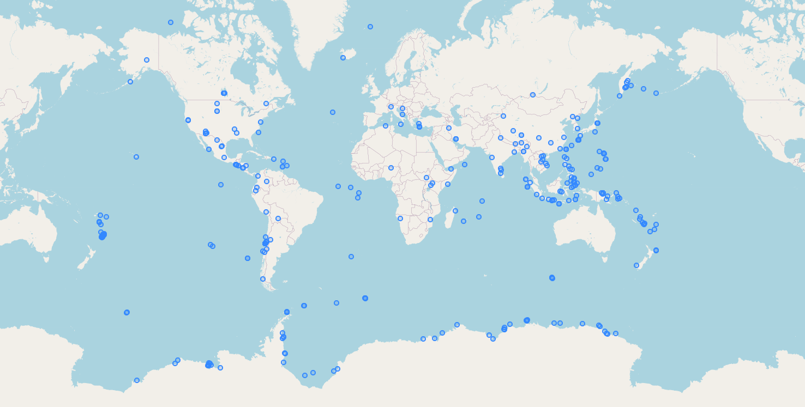

# Hazard events crawler 



Crawler of the natural hazard events data.

## How it works

Natural hazard events data provided by external authorities is loaded 
into the `hazard_events` layer located in PosgreSQL/PostGIS database.

## Getting started

### Setup Python 3 environment

1. Install [PostGIS database](https://postgis.net/install/).
2. Install [GDAL](https://gdal.org/download.html#binaries).
3. Install [Python 3](https://realpython.com/installing-python/).
4. Install GDAL python bindings  (check your version by using `gdalinfo --version`).  
   `python3 -m pip install gdal==2.4.1`
5. Install a PostgreSQL adapter for the Python.   
   `python3 -m pip install psycopg2-binary`

### Setup the hazard events crawler database

Initialize database connection settings and create the `hazard_events` table.  
`python3 scripts/pgsetup.py` 
     
### Run Crawler

Import the hazard events data from external providers.  
`python3 scripts/import_all.py`  

## Database schema

All data is loaded into `hazard_events` table located in `crawler` schema. 

```
ATTRIBUTE LIST
geom        geography(Point,4326)
fid         integer
event_id    text
event_type  text
event_date  timestamp
alert_level text
name        text
description text
origin      text
origin_id   text
```


During `pgsetpu.py` process there are created views for specific hazard types:
- `earthquake_events`
- `severe_storm_events`
- `flood_events`
- `volcano_events`
- `drought_events`

All views have the same attributes as `hazard_events` table.

## Provider list
   - [Global Disaster Alerting and Coordination System (GDACS)](https://www.gdacs.org/feed_reference.aspx)  
   - [Earth Observatory Natural Event Tracker (EONET)](https://eonet.sci.gsfc.nasa.gov/docs/v3)  
   - [USGG Earthquake Hazards Program](https://earthquake.usgs.gov/fdsnws/event/1/)  
   - [EPOS Seismic Portal](https://www.seismicportal.eu/fdsn-wsevent.html)  

## Things to consider

- Each provider has different set of attributes. In current implementation missing attributes are set to `NULL`.
  This behaviour can be changed eg. by limiting list of attributes to common denominator.
- Some attributes can be calculated from others. Eg. `alert_level` may be calculated using earthquake magnitude value.
- Some providers have single feature per event (eg. GDACS). 
  Other have multiple features per single event (eg. EONET). 
  In current implementation when multiple features occurs, only last feature is used. 
  This behaviour can be changed eg. by moving from `Point` to `MultiPoint`.
- Some providers have single category (event type). 
  Other allow multiple categories per single event (eg. *earthquake* and *volcano*). 
  In current implementation only first category is used. 
  This behaviour can be changed by allowing multiple categories or by duplicating features with many categories.

